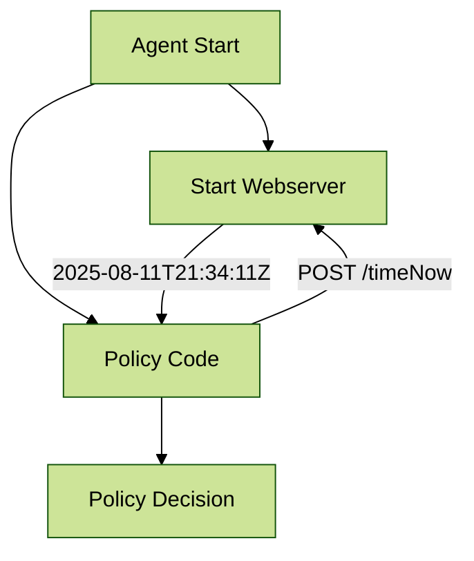

# sentinel-agent-functions

This repository contains an example implementation of custom Sentinel agent functions using Go. In other words, leveraging Go code to extend the capabilities of Sentinel policies.

The agent functions are exposed via an HTTP API and can be integrated with HashiCorp Sentinel policies.

## Challenge

[Extending Sentinel with Plugins](https://developer.hashicorp.com/sentinel/docs/extending/plugins) is a feature of Sentinel, however, this has not been implemented in HCP Terraform or Terraform Enterprise.

What this means is that we are unable to natively extend Sentinel Policies for use cases that require functionality outside of what the Sentinel language can do.

When writing policies to meet complex organizational requirements, I am often limited by what the language can do.

A few examples are:

- Converting XML to JSON
- Sleeping to wait
- Getting the current time in various formats

## Goals

I created this repository to demonstrate a kind of framework that would allow me to create Go functions that I could call from Sentinel policies, starting with a few common use cases I have run into in the past.

Adding new functions should be straight forward and involve minimal changes to the existing codebase.

## Requirements

In order for this framework to work, you need to have the following:

- HCP Terraform Premium or Terraform Enterprise
- Using Terraform Agents
  - [HCP Terraform Agents](https://developer.hashicorp.com/terraform/cloud-docs/agents)
  - [TFE Terraform AAgents](https://developer.hashicorp.com/terraform/enterprise/application-administration/agents-on-tfe)
- Policy Set execution set to "Agent"

## How does this work?

Magic. Well, not really but is does involve some cheeky bits.

Essentially the agent functions are implemented as HTTP endpoints (one for each function) on a webserver that is only exposed internally to the container running the Sentinel Policy. The policy can then call these endpoints to "execute" the functions.

### Architecture

There are a few moving pieces in this architecture:

1. Webserver hosting HTTP endpoints for each function
  - This is implemented with the code in the `./app` folder
2. Custom Terraform Agent
  - This is built using the `./Dockerfile`
3. Sentinel Policy Set with a Policy that calls the agent functions
  - There is a demo implementation: `./policies/demo-agent-functions.sentinel`



### Implementation

To run the agent functions in a Sentinel Policy, you can build and run the Docker container and connect it to a Agent Pool in HCP Terraform (be sure you have an HCP Terraform Premium Organization).

1. Create an Agent Pool.
2. Create an AGENT_TOKEN.
3. Create a Policy Set with the `sentinel.hcl` file in this repo (VCS integration is ideal)
4. Create a workspace and assign it to the Agent Pool.
5. Execute a plan and apply it using the workspace.

## Development

To develop and test the agent functions you can build and run the Docker container locally (you will need to connect it to a working Agent Pool though), this will allow you to run Sentinel tests.

1. Build the Docker image `task agent-build`
2. Set the AGENT_TOKEN environment variable
3. Run the Docker container `task agent-start`

## Web Server

The web server leverages `go-chi` to give a lightweight and idiomatic way to build HTTP services in Go and is completely contained within the `./app` directory.

### main.go

This is the entry point for the webserver that creates the routes, and starts the websserver.

Each function gets its own HTTP endpoint.
I choose POST for every function to give a consistent and predictable interface for functions that allows inputs and outputs.

The function is implemented in its own file, mainly for readability, but also to keep go testing simple (For example: `timeNow.go`)

To add this function, it looks like this:

```go
r.Post("/timeNow", TimeNow)
```
### timeNow.go

Each function file should have the same formatting and structure to ensure consistency and readability. This includes:

- A struct for Inputs
- A struct for Outputs
- A function to handle the HTTP request

A basic example:

```go
// The inputs from Sentinel to the agent function
type FooInputs struct {
	Input1 string `json:"input1"`
}

// The outputs from the agent function to Sentinel
type FooOutputs struct {
	Output1 string `json:"output1"`
}

func Foo(w http.ResponseWriter, r *http.Request) {
	data := &FooInputs{}
	err := json.NewDecoder(r.Body).Decode(&data)
	if err != nil {
		http.Error(w, "Invalid JSON", ERROR_STATUS)
		return
	}

  // Do something with data.Input1

	resp := FooOutputs{
		Output1: "Some output",
	}
	w.Header().Set("Content-Type", "application/json")
	json.NewEncoder(w).Encode(resp)
}
```

## Sentinel

Rather than call the agent function directly, I wrapped things in a repeatable way using `./functions/agent-functions.sentinel`.

This function does have some local variables to help with extensibility.

An example using the `timeNow` function:

```
func timeNow(){
	endpoint = AGENT_ENDPOINT + "timeNow"
	req = http.request(endpoint).with_body(json.marshal({}))
	response = http.accept_status_codes(ACCEPTED_STATUS_CODES).post(req)
    response_json = json.unmarshal(response.body)

	return response_json.time
}
```

This function can now be called in a Sentinel policy using the following:

```
import "agent-functions" as agent

start = agent.timeNow()
print("timeNow():", start)
```

## References

- [Sentinel Documentation](https://docs.sentinel.dev)
- [Go Chi](https://github.com/go-chi/chi)
